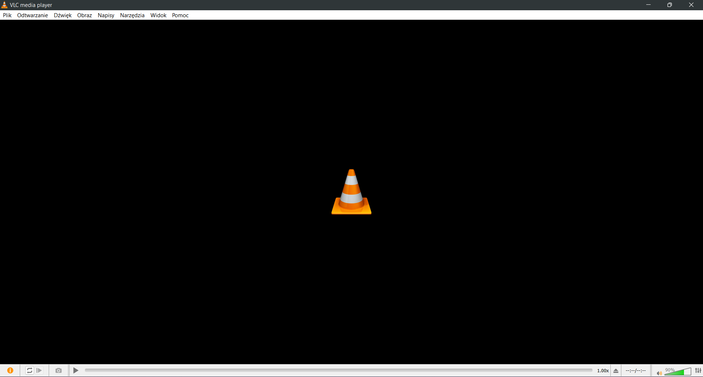

> This file contains preferences for **minimalictic** VLC Media Player interface.

# How to Import
1. Go to `%appdata%\vlc\` (eq. Pres `Windows`+`R` and enter it here).
2. Open `vlc-qt-interface.ini` file with any text editor.
3. Head to `[ToolbarProfiles]` and under this section paste content of [`wsu_VLC.txt`](./wsu_VLC.txt) file from this respository.
4. Change the first character in both lines to corresponding number (next free integer).

# How to Apply
1. Open **VLC** and head to `Tools»Customize Interface...`  

2. In the drop-down menu with label *Select profile* choose wsu_VLC and save changes.
